<p align="center">
  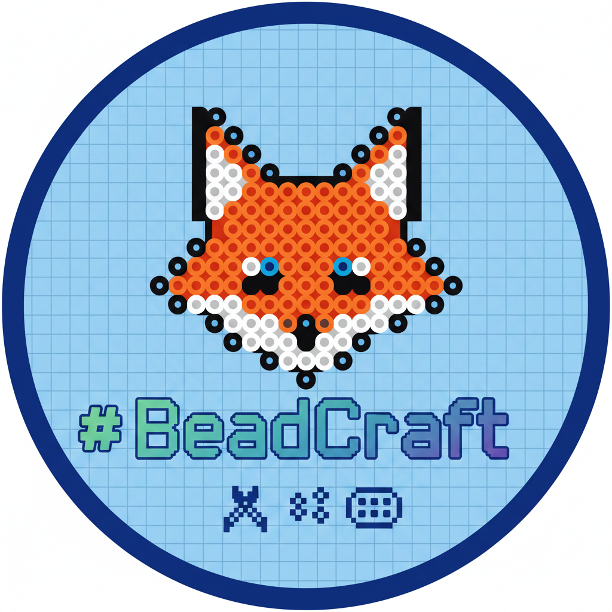
</p>

<h1 align="center">BeadCraft</h1>

<p align="center">
  Convert any image into a Perler/Artkal bead pattern.<br>
  Upload a photo or illustration, adjust parameters, and export a pixel-perfect bead layout as PNG or PDF.
</p>

## Examples

### Cartoon / Illustration (96x96 grid, background removed)

| Original | Mosaic Preview | Bead Pattern |
|:--------:|:--------------:|:------------:|
| 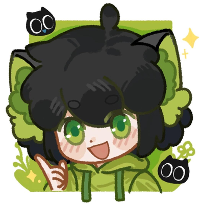 | 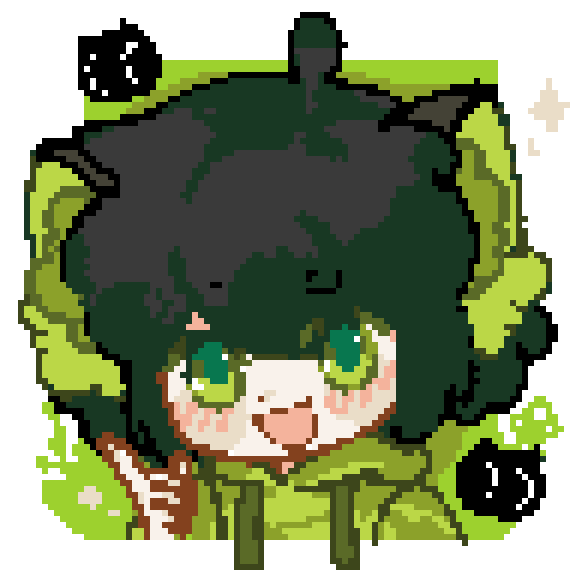 | 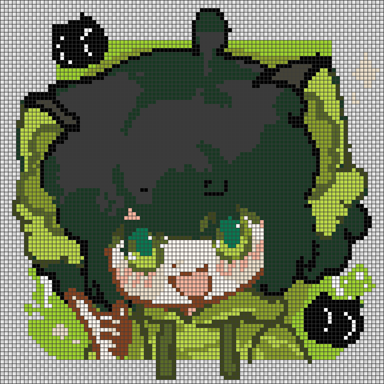 |
| 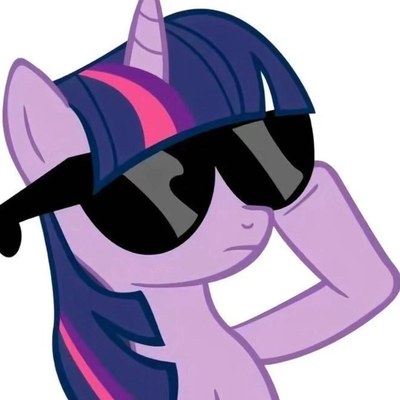 | 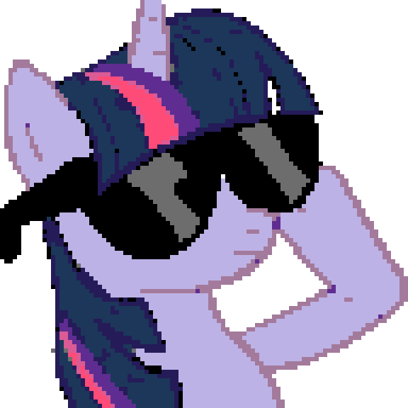 | 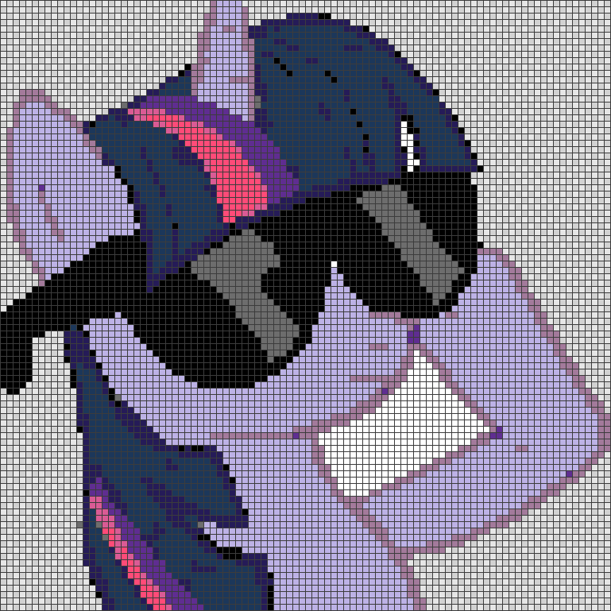 |
|  |  | 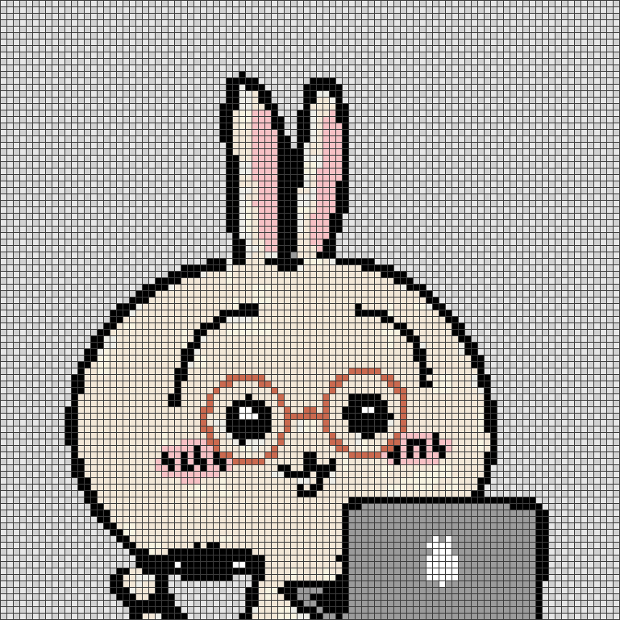 |

### Photography (72x96 grid)

| Original | Mosaic Preview | Bead Pattern |
|:--------:|:--------------:|:------------:|
| 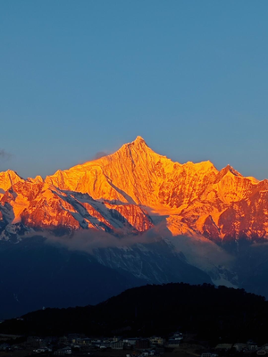 | 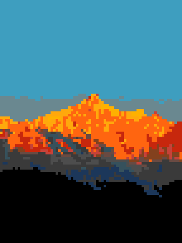 | 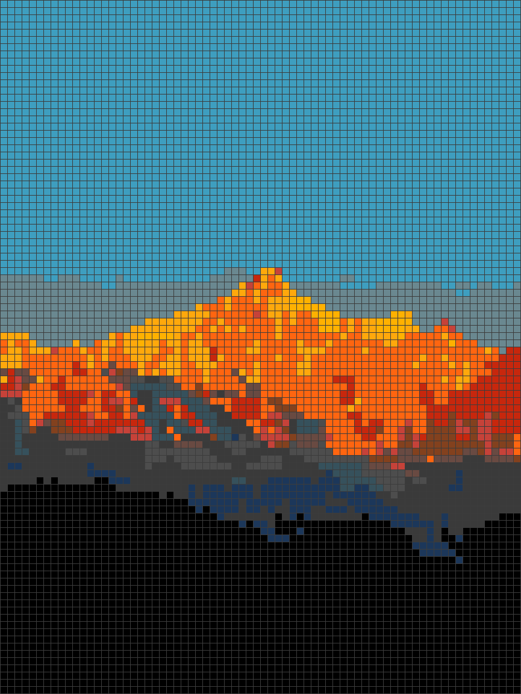 |

## Tech Stack

- **Backend**: Python 3.8+ / FastAPI / Uvicorn
- **Image Processing**: Pillow / NumPy
- **Color Matching**: CIE Lab color space (Euclidean distance)
- **Export**: Pillow (PNG) / ReportLab (PDF)
- **Frontend**: Vanilla JS + Jinja2 templates

## Project Structure

```
beadcraft/
  main.py                 # FastAPI entry, all API endpoints
  requirements.txt        # Python dependencies
  core/
    color_match.py        # CIE Lab conversion, ArtkalPalette (221 colors, 5 presets)
    quantizer.py          # Image quantization pipeline (preprocessing, grid building,
                          #   palette mapping, color merging, edge smoothing, bg removal)
    dithering.py          # Floyd-Steinberg dithering
    exporter.py           # PNG and PDF export (with coordinates, cell codes, color summary)
  data/
    artkal_m_series.json  # 221 Artkal M-series bead colors
    artkal_presets.json   # 5 preset subsets: 96 / 120 / 144 / 168 / 221
  templates/
    index.html            # Main page template
  static/
    style.css             # Styles
    app.js                # Frontend logic (upload, canvas, export, edit mode)
```

## Quick Start

```bash
cd beadcraft
pip install -r requirements.txt
python main.py
# Server runs at http://localhost:8000
```

Or with uvicorn directly:

```bash
cd beadcraft
python -m uvicorn main:app --host 0.0.0.0 --port 8000
```

## API Endpoints

| Method | Path | Description |
|--------|------|-------------|
| GET | `/` | Main web UI |
| GET | `/api/palette` | Full palette data + presets |
| POST | `/api/generate` | Upload image, return bead pattern |
| POST | `/api/export/png` | Export pattern as PNG |
| POST | `/api/export/pdf` | Export pattern as PDF |
| POST | `/api/update_cell` | Edit a single cell color |

Interactive API docs at `/docs`.

## Quantization Pipeline

The core algorithm in `quantizer.py` uses a hybrid mosaic pipeline inspired by [PixArt-Beads](https://github.com/Chipdelmal/PixelatorBeads): LANCZOS anti-aliasing + palette quantization + mode-pool downsampling.

1. **Preprocessing** - Adaptive contrast (histogram-based), saturation, sharpness enhancement at 6x intermediate resolution
2. **Dark/Light Consolidation** - Desaturate near-black (L\*<80) and near-white (L\*>210) pixels to prevent median-cut from splitting visually identical dark/light shades
3. **Sub-palette Selection** - Analyze image at 120x120, select top-N most relevant colors from the full Artkal palette (N=12~40, auto-estimated by image variance)
4. **LANCZOS Downscale to 4x Grid** - Anti-aliased downscale to 4x the target grid size, preserving smooth edges
5. **Quantize at 4x Resolution** - PIL `quantize()` with sub-palette (median cut, method=0). Higher resolution gives better color decisions per region
6. **Mode-Pool to Grid** - For each 4x4 block, pick the most frequent palette index (majority vote). Cleaner than NEAREST (random) or LANCZOS (color blending)
7. **Code Matrix** - Map each pixel RGB to its bead color code
8. **Rare Color Cleanup** - Auto-remove colors appearing in <0.5% of pixels
9. **Color Merging** - Merge similar low-frequency colors into neighbors (CIE Lab distance)
10. **Max Colors Cap** - Keep top-N most frequent colors, remap rest to nearest allowed
11. **Edge Smoothing** - Replace isolated single-pixel islands with neighbor majority, preserve details (Lab distance > 30)
12. **Background Removal** - Flood-fill from border edges: detect dominant border color, erase connected region

---

# Parameter Tuning Guide

## All Parameters

| Parameter | UI Control | Range | Default | Description |
|-----------|-----------|-------|---------|-------------|
| Palette Preset | Buttons | 96/120/144/168/221 | 221 | Number of available bead colors |
| Bead Board Size | Dropdown / Slider | 15x15 ~ 96x96 | 48x48 | Output grid dimensions |
| Max Colors | Slider | 0-60 | 0 (auto) | Limit number of unique colors. 0 = unlimited |
| Color Merge Threshold | Slider | 0-50 | 0 (off) | Merge similar colors (Lab distance). Higher = more merging |
| Contrast | Slider | -50 ~ +50 | 0 (auto) | Image contrast. 0 = auto (histogram-based) |
| Saturation | Slider | -50 ~ +50 | 0 (auto) | Color saturation. 0 = auto (slight 1.1x boost) |
| Sharpness | Slider | -50 ~ +50 | 0 (auto) | Edge sharpness. 0 = auto (moderate 1.3x) |
| Background Removal | Checkbox | on/off | off | Flood-fill remove dominant border color |
| Dithering | Checkbox | on/off | off | Floyd-Steinberg dithering for smoother gradients |

## Tuning Recipes

### Cartoon / Flat Art (logo, pixel art, anime cell-shading)

Goal: clean flat color blocks, sharp boundaries.

| Parameter | Value | Reason |
|-----------|-------|--------|
| Max Colors | 10-20 | Cartoons have limited colors, reducing avoids noise |
| Color Merge | 8-15 | Merge slight color variations into clean blocks |
| Contrast | +10 ~ +20 | Sharpen color boundaries |
| Saturation | +10 ~ +20 | Make bead colors more vivid to match bold art |
| Sharpness | 0 (auto) | Default is sufficient for flat art |
| Dithering | OFF | Dithering adds noise to flat areas |
| Grid Size | 29x29 or 48x48 | Depends on detail level needed |

### Photograph (pet, portrait, landscape)

Goal: preserve smooth gradients and fine details.

| Parameter | Value | Reason |
|-----------|-------|--------|
| Max Colors | 0 (auto) or 25-40 | Photos need many colors for gradients |
| Color Merge | 0 or 5-10 | Too much merging destroys photo gradients |
| Contrast | 0 (auto) or +10 | Auto works well; boost slightly for dark photos |
| Saturation | +5 ~ +15 | Slight boost helps bead colors match photo tones |
| Sharpness | +15 ~ +30 | Helps preserve fine details (eyes, fur, text) |
| Dithering | try both | ON gives smoother gradients; OFF gives cleaner blocks |
| Grid Size | 48x48 or larger | More pegs = more detail |

### Low-Contrast / Blurry Image

Goal: recover lost detail and make features distinct.

| Parameter | Value | Reason |
|-----------|-------|--------|
| Contrast | +20 ~ +40 | Strongly boost to separate features |
| Sharpness | +20 ~ +40 | Compensate for blur |
| Saturation | +10 ~ +20 | Boost to differentiate washed-out colors |
| Max Colors | 10-20 | Fewer colors simplify muddy areas |
| Color Merge | 10-20 | Clean up similar muddy tones |

### Image with Solid Background (product photo, sticker)

Goal: isolate subject, remove background.

| Parameter | Value | Reason |
|-----------|-------|--------|
| Background Removal | ON | Detects border color and flood-fills as transparent |
| Max Colors | 15-25 | Subject usually has fewer colors than full scene |
| Color Merge | 5-10 | Clean up edge artifacts from background boundary |

## Parameter Interaction Tips

1. **Color Merge + Max Colors**: Use merge first to consolidate similar colors, then cap with max colors. Merge is gentler (only merges truly similar), max colors is harder (forces remap).

2. **Contrast + Sharpness**: Both increase perceived detail but differently. Contrast separates light/dark tones. Sharpness enhances edges. For blurry photos, boost both. For already-sharp images, contrast alone is enough.

3. **Saturation + Palette Preset**: Higher saturation works better with larger presets (168/221) which have more vivid color options. With small presets (96), high saturation may cause odd color mapping.

4. **Dithering + Color Merge**: These work against each other. Dithering adds varied pixels for smooth gradients, but merge consolidates them. If using dithering, keep merge low (0-5).

5. **Grid Size vs Detail**: Larger grids preserve more detail but cost more beads and time. For a first draft, try 29x29. For a final piece, use 48x48 or 58x58.

## Workflow Recommendation √

1. Upload image, leave all defaults (0 = auto), click Generate
2. Check the result. If colors look muddy or noisy, adjust:
   - Too many similar colors -> increase Color Merge (10-20)
   - Colors look washed out -> increase Saturation (+15~+30)
   - Details are blurry -> increase Sharpness (+15~+30)
   - Background is distracting -> enable Background Removal
3. If the total color count is too high for your bead inventory, set Max Colors to your limit
4. Use Edit mode to manually fix individual cells if needed
5. Export as PNG (with codes and coordinates) for reference, or PDF for printing
